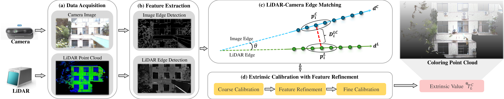

# E2E 
### E2E: Targetless Automatic Edge-2-Edge extrinsic calibration algorithm.

### 📢 Source Code Public
Since our work is still in the review process of IEEE TIM, and this work is currently linked to project, it is temporarily confidential.
After the paper is accepted and the project is completed, the code will be open source.

### 📬 Contact
If you have any questions, please feel free to contact: Weijie Zhu [zwj@seu.edu.cn]

## 1. Introduction
### E2E is a targetless, automatic edge-to-edge calibration method based solely on laser reflectivity, aimed at enhancing calibration accuracy and feature consistency in the LiDAR-Camera calibration (LCC) task. Traditional methods primarily focus on the 3D information of LiDAR point clouds for feature detection. In contrast, the proposed method leverages the superior capabilities of laser reflectivity to perceive color, depth, and material properties. This strategy enables robust edge feature consistency in 2D, thereby enhancing overall calibration accuracy.

    

## 2. Hardware Platform and Dataset
### 2.1 To facilitate the experiment, we designed a handheld scanning device.

    

### 2.2 Hardware Lists

<table>
  <tr>
    <th align="center">Item</th>
    <th align="center" style="width: 15%;">Pics</th>
    <th align="center">Purchasing list</th>
  </tr>
  <tr>
    <td align="center">Livox Mid-70 LiDAR</td>
    <td align="center"></td>
    <td align="center"><a href="https://www.livoxtech.com/cn/mid-70">Livox Mid-70</a></td>
  </tr>
  <tr>
    <td align="center">RealSense D435i</td>
    <td align="center"></td>
    <td align="center"><a href="https://www.intelrealsense.com/depth-camera-d435i/">D435i</a></td>
  </tr>
  <tr>
    <td align="center">Orbbec Gemini2</td>
    <td align="center"></td>
    <td align="center"><a href="https://developer.orbbec.com.cn/gemini2.html">Gemini2</a></td>
  </tr>
  <tr>
    <td align="center">HK MV-CU050-90UC</td>
    <td align="center"></td>
    <td align="center"><a href="https://www.hikrobotics.com/cn/machinevision/productdetail?id=9745">MV-CU050-90UC</a></td>
  </tr>
  <tr>
    <td align="center">HK MV-CE060-10UC</td>
    <td align="center"></td>
    <td align="center"><a href="https://www.hikrobotics.com/cn/machinevision/visionproduct?typeId=27&id=42&pageNumber=1&pageSize=20&showEol=false&conditionSelected=">MV-CE060-10UC</a></td>
  </tr>
  <tr>
    <td align="center">DJI OSMO Action4</td>
    <td align="center"></td>
    <td align="center"><a href="https://www.dji.com/cn/osmo-action-4">Action4</a></td>
  </tr>
</table>

## 3. Experiment Result of Natural Scenes
### 3.1 The experimental scenes, illustrated in below figure, include eight randomly selected natural environments such as corridors, walls, buildings, and parking area. 

    

### 3.2 The exmaple dataset can be download from the link below
- 🔴Password: 2025  
- 🔓 [**BaiduNetDisk(百度网盘)**](https://pan.baidu.com/s/1ahdxv8vL05-QIoMGVL6S6Q?pwd=2025)

### 3.3 The calibration result of overlapping map between the laser refectivity and original image.

    

